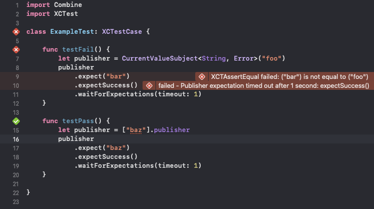

# Testable Combine Publishers

An easy, declarative way to unit test Combine Publishers in Swift



## About

Combine Publishers are [notoriously verbose to unit test](https://mokacoding.com/blog/testing-combine-publisher-cheatsheet/#how-to-test-publisher-publishes-one-value-then-finishes). They require you to write complex Combine chains in Swift for each test, keeping track of `AnyCancellable`s, and interweaving `XCTestExpectation`s, fulfillment requirements, and timeouts.

This Swift Package aims to simplify writing unit tests for Combine `Publisher`s by providing a natural spelling of `.expect(...)` for chaining expectations on the `Publisher` subject. The resulting `PublisherExpectation` type collects the various expectations and then provides a way to assert that the expectations are fulfilled by calling `.waitForExpectations(timeout: 1)`

Under the hood, `PublisherExpectation` is utilizing standard `XCTest` framework APIs and forwarding those assertion results to the corresponding lines of code that declared the expectation. This allows you to quickly see which specific expectation, in a chain of expectations, is failing in your unit tests, both in Xcode and in the console output.

## Usage

In an `XCTestCase`, add a new unit test function, as normal, preparing the `Publisher` test subject to be tested. Utilize any combination of the examples below to validate the behavior of any `Publisher` in your unit tests.

### Examples

For a `Publisher` that is expected to emit a single value and complete with `.finished`
```swift
func testSingleValueCompletingPublisher() {
    somePublisher
        .expect(someEquatableValue)
        .expectSuccess()
        .waitForExpectations(timeout: 1)
}

func testSingleValueCompletingPublisher() async throws {
    let value = somePublisher.awaitFirstValue()
    XCTAssertEqual(value, someEquatableValue)
}
```

For a `Publisher` that is expected to emit multiple values, but is expected to not complete
```swift
func testMultipleValuePersistentPublisher() {
    somePublisher
        .collect(someCount)
        .expect(someEquatableValueArray)
        .expectNoCompletion()
        .waitForExpectations(timeout: 1)
}
```

For a `Publisher` that is expected to fail
```swift
func testPublisherFailure() {
    somePublisher
        .expectFailure()
        .waitForExpectations(timeout: 1)
}
```

For a `Publisher` that is expected to emit a value after being acted upon externally
```swift
func testLoadablePublisher() {
    let test = someDataSource.publisher
        .expect(someEquatableValue)
    someDataSource.load()
    test.waitForExpectations(timeout: 1)
}
```

For a `Publisher` expected to emit a single value whose `Output` is not `Equatable`
```swift
func testNonEquatableSingleValue() {
    somePublisher
        .expect({ value in
            if case .loaded(let model) = value, !model.rows.isEmpty { } else {
                XCTFail("Expected loaded and populated model")
            }
        })
        .waitForExpectations(timeout: 1)
}
```

For a `Publisher` that should emit a specific non-`Equatable` `Error`
```swift
func testNonEquatableFailure() {
    somePublisher
        .expectFailure({ failure in 
            switch failure {
            case .noInternet, .airPlaneMode:
                break
            default:
                XCTFail("Expected connectivity error")
            }
        })
        .waitForExpectations(timeout: 1)
}
```

## Available Expectations

### Value Expectations

- `expect(_ expected: Output)` - Asserts that the provided `Equatable` value will be emitted by the `Publisher`
- `expectNot(_ expected: Output)` - Asserts that a value will be emitted by the `Publisher` and that it does NOT match the provided `Equatable`
- `expect(_ assertion: (Output) -> Void)` - Invokes the provided assertion closure on every value emitted by the `Publisher`. Useful for calling `XCTAssert` variants where custom evaluation is required

### Success Expectations

- `expectSuccess()` - Asserts that the `Publisher` data stream completes with a success status (`.finished`)

### Failure Expectations

- `expectFailure()` - Asserts that the `Publisher` data stream completes with a failure status (`.failure(Failure)`)
- `expectFailure(_ failure: Failure)` - Asserts that the provided `Equatable` `Failure` type is returned when the `Publisher` completes
- `expectNotFailure(_ failure: Failure)` - Asserts that the `Publisher` completes with a `Failure` type which does NOT match the provided `Equatable` `Failure`
- `expectFailure(_ assertion: (Failure) -> Void)` - Invokes the provided assertion closure on the `Failure` result's associated `Error` value  of the `Publisher`. Useful for calling `XCTAssert` variants where custom evaluation is required

### Completion Expectations

- `expectCompletion()` - Asserts that the `Publisher` data stream completes, indifferent of the returned success/failure status
- `expectNoCompletion()` - Asserts that the `Publisher` data stream does NOT complete. ⚠️ This will wait for the full timeout in `waitForExpectations(timeout:)`
- `expectCompletion(_ assertion: (Completion<Failure>) -> Void)` - Invokes the provided assertion closure on the `recieveCompletion` handler of the `Publisher`. Useful for calling `XCTAssert` variants where custom evaluation is required

## Upcoming Features

- Support for working with `Scheduler`s to avoid relying on timeouts

